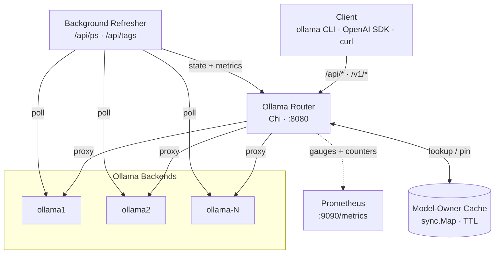

# 🧠 Ollama Router


Model-aware reverse proxy that load-balances inference traffic across a
fleet of Ollama backends, with health checking, latency tracking, and
session pinning via a TTL'd model-ownership cache.

The routing decision picks in this order:

1. **Cache hit** — session already pinned to a node (TTL-gated)
2. **Loaded in VRAM** — node has the model resident
3. **Local on disk** — node has the model, no warm-up cost vs pulling
4. **Least busy** — fewest loaded models, lower latency as tie-breaker

---

## 🚀 Features

| Feature | Description |
| --- | --- |
| 🎯 **Model-aware routing** | Routes by model availability across the fleet (`HIT_CACHE`, `HIT_LOADED`, `HIT_LOCAL`, `FALLBACK_LEAST_BUSY`) |
| ⚖️ **Load balancing** | Tie-breaks on loaded model count, then latency |
| ❤️ **Health checks** | Concurrent `/api/ps` + `/api/tags` polling; unhealthy nodes drop out automatically |
| 🧠 **Ownership cache** | `sync.Map` with TTL keeps follow-up requests sticky to the warm node |
| 🔀 **Native + OpenAI APIs** | `/api/generate\|chat\|embeddings` and `/v1/chat/completions\|embeddings\|models` |
| 📦 **Smart `pull`/`push`/`copy`/`show`** | Per-verb routing respecting where the model actually lives |
| 📣 **Broadcast `delete`** | Fans out to every healthy node, returns first 2xx/3xx |
| 📊 **Prometheus metrics** | Routing decisions, request rates, node health/latency gauges on a separate port |
| 🛡️ **Graceful shutdown** | SIGINT/SIGTERM, context cancel, background refresher join |

---

## 📦 Installation

### 🐳 Docker (recommended)

Pre-built multi-arch images are published to both registries:

| Registry | Image |
| --- | --- |
| Docker Hub | `obeoneorg/ollama-router` |
| GHCR | `ghcr.io/obeone/ollama-router` |

```bash
docker run --rm -p 8080:8080 -p 9090:9090 \
  -e OLLAMA_NODES_JSON='[{"name":"ollama1","baseURL":"http://host.docker.internal:11434"}]' \
  obeoneorg/ollama-router:latest
```

Or build it yourself — static binary on `gcr.io/distroless/static-debian12`
(see [`Dockerfile`](Dockerfile)):

```bash
docker build -t ollama-router .
```

### ⚓ Helm

```bash
helm install ollama-router ./charts/ollama-router \
  --set 'config.ollamaNodes[0].name=ollama1' \
  --set 'config.ollamaNodes[0].baseURL=http://ollama1.svc:11434'
```

See [`charts/ollama-router/`](charts/ollama-router/) for the full values
schema.

### 🛠️ Local build

```bash
go build -o ollama-router .
OLLAMA_NODES_JSON='[{"name":"n1","baseURL":"http://localhost:11434"}]' ./ollama-router
```

---

## ⚙️ Configuration

All configuration is environment-driven.

| Variable | Default | Purpose |
| --- | --- | --- |
| `OLLAMA_NODES_JSON` | demo nodes | JSON list of `{name, baseURL}` backends — **required in prod** |
| `LISTEN_ADDR` | `:8080` | Main proxy listen address |
| `METRICS_ADDR` | `:9090` | Prometheus listen address (separate mux) |
| `POLL_INTERVAL_SECONDS` | `5` | Background health-check interval |
| `MODEL_CACHE_TTL_SECONDS` | `120` | TTL for the model-ownership cache |
| `CONNECT_TIMEOUT_SECONDS` | `5` | Backend connect timeout |
| `READ_TIMEOUT_SECONDS` | `600` | Backend read timeout (long for streaming) |
| `LOG_LEVEL` | `debug` | `debug` · `info` · `warn` · `error` |

### Nodes example

```json
[
  { "name": "ollama1", "baseURL": "http://ollama1.internal:11434" },
  { "name": "ollama2", "baseURL": "http://ollama2.internal:11434" }
]
```

---

## 🌐 Endpoints

| Path | Method | Behavior |
| --- | --- | --- |
| `/` | `GET` · `HEAD` | Returns `Ollama is running` (CLI compat) |
| `/healthz` | `GET` | Per-node state + cache size |
| `/api/generate` · `/api/chat` · `/api/embeddings` | `POST` | Model-aware proxy |
| `/v1/chat/completions` · `/v1/embeddings` | `POST` | OpenAI-compatible, model-aware |
| `/v1/models` | `GET` | OpenAI-format aggregated tags |
| `/api/tags` · `/api/ps` | `GET` · `POST` | Aggregated/deduped across nodes |
| `/api/pull` · `/api/push` · `/api/copy` · `/api/create` · `/api/show` | `POST` | Specific routing per verb |
| `/api/delete` | `POST` | Broadcast to all healthy nodes |
| `/api/version` | `GET` | Proxied to the least-busy healthy node |
| `/api/*` | any | Catch-all: model-aware for POST, else least-busy |
| `/metrics` *(on `METRICS_ADDR`)* | `GET` | Prometheus exposition |

---

## 🧪 Development

| Command | Purpose |
| --- | --- |
| `go build -o ollama-router .` | Build the binary |
| `go vet ./...` | Static checks |
| `go test ./...` | Run all tests |
| `go test -run TestChooseNodeForModel ./...` | Run a single test |
| `go run .` | Run with default demo nodes |
| `docker build -t ollama-router .` | Build the container image |

The code is a flat `package main` — one file per concern
(`routing.go`, `handlers.go`, `state.go`, `metrics.go`, …). See
[`CLAUDE.md`](CLAUDE.md) for the architectural invariants.

---

## 🏗️ Architecture



---

## 📊 Observability

- Prometheus metrics on a **separate** server (`METRICS_ADDR`, default `:9090`)
- Counters: `routing_decisions_total{decision,model}`, request totals
- Gauges per node: `node_health`, `node_latency_ms`, `node_loaded_models`
- Structured logs via `slog` + [`tint`](https://github.com/lmittmann/tint)
- `/healthz` for liveness/readiness probes

---

## 🤝 Contributing

Issues and PRs welcome. Keep changes focused and add a test that fails
on the old behavior when fixing a bug.

## 📝 License

MIT — see source headers.
