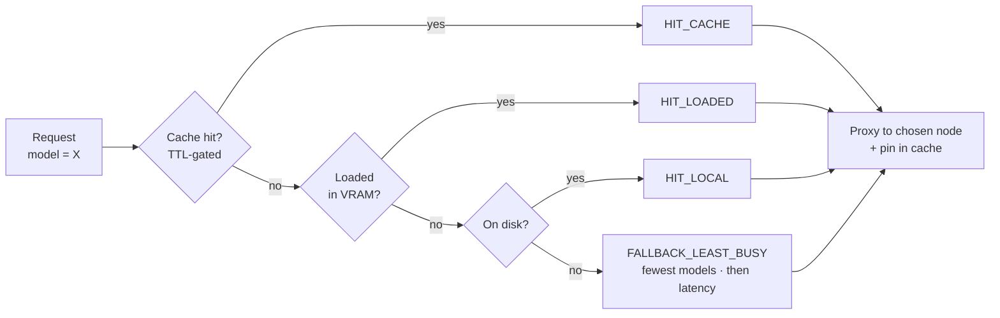
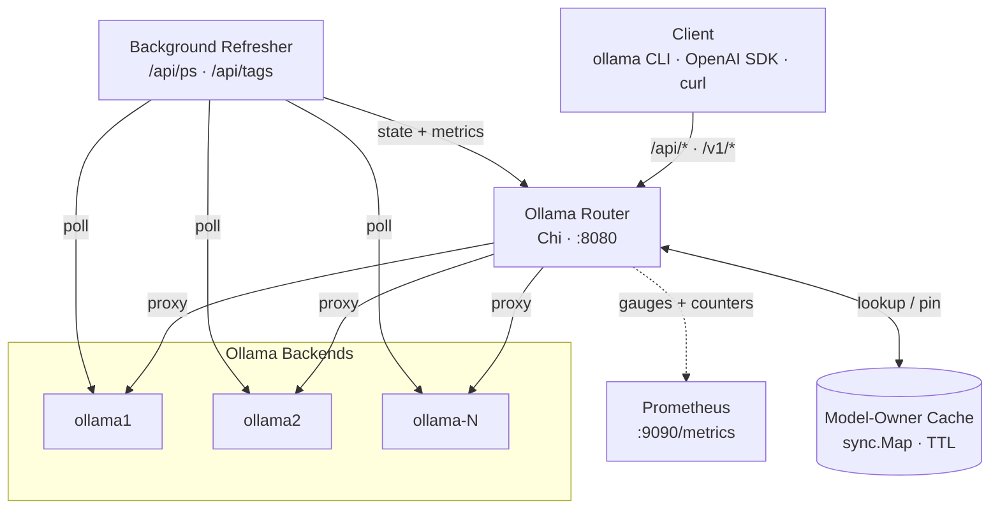

<div align="center">

# 🧠 Ollama Router

**A model-aware reverse proxy that turns a fleet of Ollama backends into one smart endpoint.**

Point your `ollama` CLI or any OpenAI SDK at a single URL — the router decides
*which* backend should serve each request based on where the model is warm,
where it lives on disk, and which node is least busy.


</div>

---

## ✨ Highlights

> **Drop-in compatible.** Every documented Ollama native endpoint *and* the
> OpenAI-compatible surface is wired and method-correct — the `ollama` CLI,
> native Ollama clients, and OpenAI SDKs all work unmodified against the router.

| | |
| --- | --- |
| 🎯 **Model-aware routing** | 4-tier decision tree: warm cache → loaded in VRAM → on-disk → least busy |
| 🔌 **Full API coverage** | Native `/api/*` **and** OpenAI `/v1/*`, including `/v1/completions` and `/v1/models/{id}` |
| 📦 **`ollama create` works on a cluster** | Blob uploads + `create` are pinned to the **same** backend, so local-gguf creates don't fail with "blob not found" |
| ❤️ **Self-healing fleet** | Concurrent `/api/ps` + `/api/tags` polling; unhealthy nodes drop out and rejoin automatically |
| 🧲 **Sticky sessions** | TTL'd model-ownership cache keeps a conversation glued to the warm node |
| 📊 **Prometheus-native** | Routing decisions, request rates, per-node health/latency on a separate port |
| 🛡️ **Hardened image** | Static `CGO_ENABLED=0` binary on distroless, runs as nonroot, multi-arch |

---

## 🧭 How routing decides

For every model-bearing request, the router walks this decision tree and stops
at the first match:



1. **`HIT_CACHE`** — the model is already pinned to a healthy node (TTL-gated, `sync.Map`).
2. **`HIT_LOADED`** — a healthy node has the model resident in VRAM (zero warm-up).
3. **`HIT_LOCAL`** — a healthy node has the model on disk (no pull, short warm-up).
4. **`FALLBACK_LEAST_BUSY`** — fewest loaded models wins, lower latency breaks ties.

Specialized verbs don't use the generic tree — they route to where the
operation actually makes sense (see [Endpoints](#-endpoints)).

---

## 🚀 Quick start

### 🐳 Docker (recommended)

Pre-built **multi-arch** images (`linux/amd64`, `linux/arm64`) are published to
both registries:

| Registry | Image |
| --- | --- |
| Docker Hub | `obeoneorg/ollama-router` |
| GHCR | `ghcr.io/obeone/ollama-router` |

```bash
docker run --rm -p 8080:8080 -p 9090:9090 \
  -e OLLAMA_NODES_JSON='[{"name":"ollama1","baseURL":"http://host.docker.internal:11434"}]' \
  obeoneorg/ollama-router:latest
```

Then point any client at it:

```bash
export OLLAMA_HOST=http://localhost:8080
ollama run llama3 "hello"

# or the OpenAI way
curl http://localhost:8080/v1/chat/completions \
  -H 'Content-Type: application/json' \
  -d '{"model":"llama3","messages":[{"role":"user","content":"hello"}]}'
```

Build it yourself — static binary on `gcr.io/distroless/static-debian12`,
runs as nonroot (see [`Dockerfile`](Dockerfile)):

```bash
docker build -t ollama-router .
```

### ⚓ Helm

```bash
helm install ollama-router ./charts/ollama-router \
  --set 'config.ollamaNodes[0].name=ollama1' \
  --set 'config.ollamaNodes[0].baseURL=http://ollama1.svc:11434'
```

See [`charts/ollama-router/`](charts/ollama-router/) for the full values schema.

### 🛠️ Local build

Sources live under [`cmd/ollama-router/`](cmd/ollama-router/) (single flat
`package main`, no subpackages):

```bash
go build -o ollama-router ./cmd/ollama-router
OLLAMA_NODES_JSON='[{"name":"n1","baseURL":"http://localhost:11434"}]' ./ollama-router
```

---

## ⚙️ Configuration

Everything is environment-driven. `OLLAMA_NODES_JSON` is the only one you
**must** set in production — an empty or invalid list is fatal at startup.

| Variable | Default | Purpose |
| --- | --- | --- |
| `OLLAMA_NODES_JSON` | demo nodes | JSON list of `{name, baseURL}` backends — **required in prod** |
| `LISTEN_ADDR` | `:8080` | Main proxy listen address |
| `METRICS_ADDR` | `:9090` | Prometheus listen address (separate mux) |
| `POLL_INTERVAL_SECONDS` | `5` | Background health-check interval |
| `MODEL_CACHE_TTL_SECONDS` | `120` | TTL for the model-ownership cache |
| `CONNECT_TIMEOUT_SECONDS` | `5` | Backend connect timeout |
| `READ_TIMEOUT_SECONDS` | `600` | Backend read timeout (long, for streaming) |
| `LOG_LEVEL` | `debug` | `debug` · `info` · `warn` · `error` (invalid → `debug`) |

<details>
<summary><b>📄 <code>OLLAMA_NODES_JSON</code> example</b></summary>

```json
[
  { "name": "ollama1", "baseURL": "http://ollama1.internal:11434" },
  { "name": "ollama2", "baseURL": "http://ollama2.internal:11434" }
]
```

Names must be unique — they key the node-state map, the ownership cache, and
the per-node Prometheus gauges.

</details>

---

## 🌐 Endpoints

The router speaks the **full** Ollama native API and the OpenAI-compatible
surface. Methods below are what the router accepts inbound — it forwards with
the upstream-correct method (e.g. `GET /api/ps`, `DELETE /api/delete`).

### Native Ollama API

| Path | Method | Behavior |
| --- | --- | --- |
| `/` | `GET` · `HEAD` | `Ollama is running` (CLI compatibility probe) |
| `/api/generate` · `/api/chat` | `POST` | Model-aware proxy |
| `/api/embeddings` · `/api/embed` | `POST` | Model-aware proxy |
| `/api/tags` | `GET` | Aggregated + deduped model list across all nodes |
| `/api/ps` | `GET` | Aggregated running models across all nodes |
| `/api/version` | `GET` | Proxied to the least-busy healthy node |
| `/api/pull` | `POST` | Prefers a node that already has the model, else least-busy |
| `/api/push` · `/api/copy` | `POST` | Routed to a node that holds the (source) model locally |
| `/api/show` | `POST` | Node with the model on disk **or** loaded |
| `/api/create` | `POST` | Pinned to a **stable** node |
| `/api/blobs/{digest}` | `HEAD` · `POST` | Pinned to the **same** stable node as `create` |
| `/api/delete` | `DELETE` | Broadcast to every healthy node, returns first 2xx/3xx |
| `/api/*` | any | Catch-all: model-aware for `POST`, else least-busy |

### OpenAI-compatible API

| Path | Method | Behavior |
| --- | --- | --- |
| `/v1/chat/completions` | `POST` | Model-aware proxy |
| `/v1/completions` | `POST` | Model-aware proxy |
| `/v1/embeddings` | `POST` | Model-aware proxy |
| `/v1/models` | `GET` | Aggregated tags, reshaped to OpenAI format |
| `/v1/models/{id}` | `GET` | Retrieve one model (slash- and tag-safe ids) |

### Operations

| Path | Method | Behavior |
| --- | --- | --- |
| `/healthz` | `GET` | Per-node state + ownership-cache size |
| `/metrics` *(on `METRICS_ADDR`)* | `GET` | Prometheus exposition (separate server) |

---

## 📦 `ollama create` on a multi-node cluster

`ollama create` from a local `gguf` is a **three-step handshake**:

```
HEAD /api/blobs/sha256:…   →  does this layer exist?
POST /api/blobs/sha256:…   →  upload the layer
POST /api/create           →  assemble the model from uploaded layers
```

Blob uploads (`HEAD`/`POST /api/blobs/*`) are always pinned to one
deterministically chosen healthy node, so the layer and the subsequent
`/api/create` are guaranteed to land on the same backend.

The router then picks the `/api/create` target based on how many nodes
already have that model on disk:

| Owners | Routing decision | Why |
|--------|-----------------|-----|
| **0** — brand-new model | Pinned to the stable node (same as blobs) | Keeps blob upload and create co-located; avoids a multi-GB buffer |
| **1** — model exists on one node | Routed to that node | In-place rebuild; no cross-node copy needed |
| **≥ 2** — model replicated | Broadcast to **all** owning nodes concurrently | Every replica is rebuilt consistently; first success is streamed back, others are drained so the operation completes |

> [!NOTE]
> The router never replicates a brand-new model across nodes by itself.
> To install the same model on two (or more) specific nodes, point
> `OLLAMA_HOST` directly at each target node (bypassing the router) and
> run `ollama create` once per node. After the next poll tick
> (~`POLL_INTERVAL_SECONDS`) the router detects the model on those nodes,
> and from then on any re-`create` fans out automatically (the ≥ 2 owners
> case above).

---

## 🤝 Compatibility notes

Functionally complete for a normal client. A few behaviors differ from a
*single* Ollama on purpose, because this is a fleet router:

- **`/api/tags`, `/api/ps`** return the deduped **union** across the fleet, not
  one node's view.
- **`/api/version`** reports a single (least-busy) node's version —
  non-deterministic if your nodes run mixed versions.
- **`/api/pull`** lands the model on a single node; it becomes routable
  elsewhere only after the next poll tick (~`POLL_INTERVAL_SECONDS`) via the
  on-disk tier (eventual consistency, not an incompatibility).

---

## 🏗️ Architecture



The code is a flat `package main` under `cmd/ollama-router/` — one file per
concern:

| File | Concern |
| --- | --- |
| `main.go` | Wiring: Chi router, metrics server, refresher goroutine, graceful shutdown |
| `config.go` | Environment loading |
| `state.go` | `AppState` / per-node `NodeState`, background health refresher |
| `routing.go` | The decision tree and `choose*` node selectors |
| `handlers.go` | Chi routes: model-aware proxy, aggregators, per-verb routing, broadcast |
| `utils.go` | Reverse-proxy wrapper, typed JSON client, body/model extraction |
| `metrics.go` | Prometheus collectors |
| `models.go` | Ollama + OpenAI wire types |

See [`CLAUDE.md`](CLAUDE.md) for the architectural invariants you must preserve
when contributing.

---

## 📊 Observability

- Prometheus metrics on a **separate** server (`METRICS_ADDR`, default `:9090`) —
  never mixed into the main proxy mux.
- Counters: `routing_decisions_total{decision,model}`, request totals (paths
  grouped to `/a/b` to bound cardinality).
- Per-node gauges: `node_health`, `node_latency_ms`, `node_loaded_models`.
- Structured logs via `slog` + [`tint`](https://github.com/lmittmann/tint).
- `/healthz` for liveness/readiness probes.

---

## 🧪 Development

| Command | Purpose |
| --- | --- |
| `go build -o ollama-router ./cmd/ollama-router` | Build the binary |
| `go vet ./...` | Static checks |
| `go test ./...` | Run all tests |
| `go test -run TestChooseNodeForModel ./...` | Run a single test |
| `go run ./cmd/ollama-router` | Run with default demo nodes |
| `docker build -t ollama-router .` | Build the container image |

Tests rely on the package globals `logger` / `metrics` initialized by
`TestMain`; any new `_test.go` must piggyback it or initialize them itself.

---

## 🤲 Contributing

Issues and PRs welcome. Keep changes focused, and when fixing a bug add a
regression test that fails on the old behavior and passes on the fix.

## 📝 License

MIT — see source headers.
